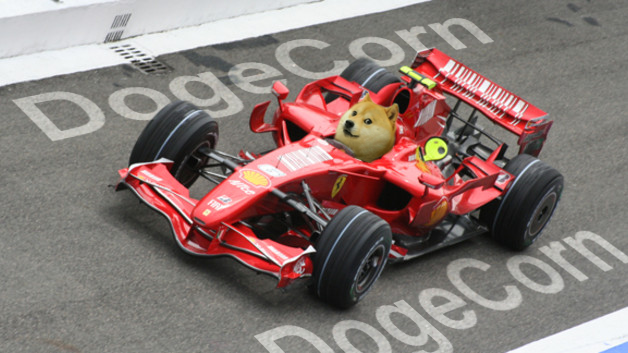
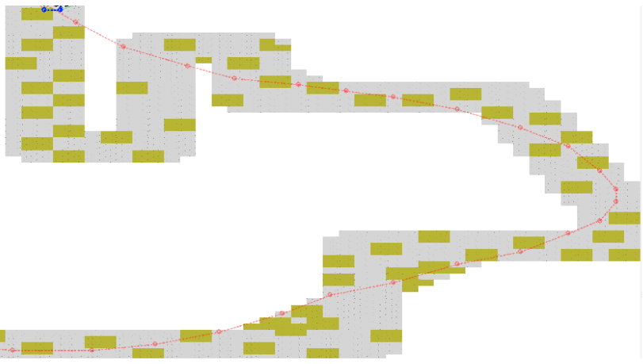

%   
  **Projet GrandPrix**
% Equipe DogeCorn
  
  Gautier Boëda
  Steven Le Rouzic
% *1A Informatique, promo 2016*

\newpage

L'objectif de ce second projet de première année informatique était de créer une IA robuste qui termine en un minimum de tours et de carburants des circuits quelconques. Ce second projet mettait en avant d'autres facultés par rapport au premier projet. Nous nous sommes donc heurtés rapidement au problème de coût et donc de réussir à trouver le meilleur chemin en un minimum de temps. Pour cela, nous avons imaginé plusieurs approches pour tenter de résoudre ce problème du mieux possible. Chacune d'entre elle a ses avantages et inconvénients. Néanmoins une d'entre elle se détache par sa robustesse et c'est celle que nous avons choisi pour concourir.

Une approche type Graphe : Dijkstra
=========================

Arcs simples
-------------------------

Cette approche consiste à utiliser l'algorithme de Dijkstra sur un graphe de positions. Nous ne détaillerons pas l'algorithme de Dijkstra (cf Graphe_dijkstra du fichier Graphe.c) mais seulement son implémentation. La représentation du graphe choisie est la version matrice d'adjacence. Elle permet un accès rapide aux cellules malgré un coût en mémoire plus important. Dans ce cas de figure, il y a 8 arcs par case. Cela correspond aux 8 cases qui entourent une case. Leur poids est de 1 car il faut une vitesse de 1 pour y accéder. Pour le cas où l'arc va dans le sable, son poids est de 5 fois le poids pour un arc vers une route. En effet, on passe au pire d'une vitesse 5 à 1. Ces arcs sont ajoutés dans la fonction Graphe_init de Graphe.c. Via cette approche, on arrive à avoir un chemin assez correct. C'est même le meilleur chemin si notre vitesse était limité à 1. Néanmoins, cela n'est pas le cas. Et le souci d'une telle méthode est qu'avec des vitesses qui vont jusqu'à 5, cela ne correspond plus au meilleur chemin. Ainsi, notre voiture déviera souvent de ce chemin calculé lorsque sa vitesse augmentera. L'avantage d'une telle méthode est son temps de calcul très rapide. Son coût dépend de la taille de la map. L'inconvénient est qu'on a un chemin peu exploitable pour une voiture ayant une vitesse supérieur à 1.

Arcs téléportations
----------------------------

Cette seconde version consiste à ajouter de nouveaux arcs en plus de ceux existant. Le but est d'ajouter des arcs dit de téléportation. En effet, tel qu'est codé le serveur, si on saute par dessus un mur, cela est autorisé. Cela nous permet de prendre des courbes très serrées sur des virages ou même sauter toute une partie de map. Pour implémenter cela, il faut d'abord chercher toutes les cellules situés en bordure de map (Cf Map_hasBorder du fichier Map.c) puis de vérifier si l'une d'elle peut atteindre une case de route en sautant par dessus un mur via un des vecteurs vitesses possibles allant de 1 à 5. Le code se trouve à la fonction Graphe_addTeleportationArc du fichier Graphe.c. On exécute un Dijkstra sur ce graphe. Cela génère un graphe de poids. Ensuite, à chaque tour, on prend la position de poids le plus faible atteignable via la case où on se trouve. L'avantage est donc un temps de calcul rapide et un chemin plus intéressant que la version 1 car nous avons un chemin qui prend en compte des courbes meilleures à pleine vitesse ainsi que des téléportations. L'inconvénient est que la voiture déviera toujours du meilleur chemin possible à cause de ces arêtes de longueur 1. Néanmoins, le chemin parcouru sera meilleur que la première version. Le chemin calculé est aussi de meilleure qualité mais reste qu'une approximation du vrai meilleur chemin.

Prévisions
------------------------------

Cette troisième version a pour but de résoudre les problèmes de déviation de chemin. On garde le même algorithme que précédement mais on va ajouter à chaque tour une recherche du meilleur chemin à une profondeur choisie.
Au tour 1, on calcule le Dijkstra suivant la version intermédiaire. Puis, du tour 1 au tour N, on explore toutes les routes possibles à une profondeur choisie (5 pour le premier tour et pour chaque tour où on recalcule le Dijkstra (A cause du temps de calcul du Dijkstra) et 6 de profondeur pour les autres tours). On garde alors la meilleure route en selectionnant la route où le poids de la dernière case atteinte est le plus faible. (Cf Route.c)
Cette recherche est très coûteuse (O(n^n) où n est le nombre de positions atteignables depuis une position). La faire exécuter sur une profondeur de 5-6 permet de prévoir les erreurs (Collision de murs, sable, et limiter la déviation du meilleur chemin). La voiture suit donc un chemin non loin du meilleur chemin. Il ne peut être optimum mais certainement l'un des meilleurs. Biensûr, plus la profondeur choisie est grande, plus le coût est grand, mais plus on est proche de la meilleure route. L'avantage est donc un temps de calcul honnête et un chemin concurrençant les meilleurs. L'inconvénient reste son coût.

Conclusions sur la méthode Dijkstra
------------------------------
Une telle méthode est difficilement exécutable sur ce genre de calcul. En effet, il faut choisir comment ajouter les arcs sans trop en ajouter. Si on ajoute les 25 arcs vitesses possibles pour chaque case, nous aurions un meilleur graphe. Mais le calcul du Dijkstra sur un tel graphe requierait de lui interdire de passer par des positions qui ne sont pas atteignables depuis la position où il est actuellement. Le coût d'une telle fonction serait globalement correct. Mais le parcours de tous les sommets avec ses 25 arcs (25 cases atteignables si boost) aurait un coût au moins 2 à 3 fois plus important que l'implémentation actuelle (8 arcs en moyenne par case). C'est pourquoi nous avons essayer de partir sur de nouvelles approches.

Seconde approche : Estimations locales
===============================

En seconde approche, nous avons réalisé un algorithme très simple qui se base sur des estimations locales : sur un certain nombre de tours à l'avance, on calcule tous les chemins possibles puis on choisit le meilleur chemin. Cet algorithme va donc dépendre entièrement du nombre de tours à l'avance, et aucunement de la taille de la carte. Le code source de cette approche est disponible dans le dossier `local`.

Détails d'implémentation
--------------------------------

### La carte de distances

Une structure de données utilisée par cet algorithme est une carte des distances de chaque case à l'arrivée. Cette distance est une distance de Manhattan qui suit la route. Pour la générer, on part d'une arrivée avec une valeur de distance de 0, puis on propage de proche en proche cette valeur en l'incrémentant à chaque fois. On fait de même pour chaque arrivée. Ceci est fait une fois la map reçue et à chaque arrivée d'une voiture à une arrivée afin de ne plus compter cette arrivée comme un but valide. Cette fonction est `void Map_computeDistance(Map map, Position origin)` et se trouve dans le fichier `Map.c`. Afin de ne pas programmer cette fonction récursivement, nous avons utilisé une structure de file. Cette fonction est appelée par `void Map_recomputeDistances(Map map, List takenPositions)` dans le fichier `Map.c` qui s'occupe de ne pas recalculer les arrivées sur lesquelles se trouve une voiture. Afin de gérer le sable, lorsque la propagation se fait sur une case contenant du sable, la valeur de la distance n'est pas simplement incrémentée mais on lui ajoute la valeur 5 afin de simuler le fait qu'il est possible de passer par cette case mais que le parcours sera plus long : on aura une vitesse maximum de 1 au lieu de 5.

### Déroulement de l'algorithme

L'algorithme se trouve dans la fonction `void doPathfinding(Map map, Car cars[3])` du fichier `main.c` qui prend en paramètres la map et les voitures sur la map, la première étant la voiture que l'on dirige. Une voiture contient un nombre de boosts restants, sa position actuelle, sa dernière position (qui permet donc de connaître sa vitesse) et une variable indiquant si elle est arrivée ou pas. Cette structure se trouve dans le fichier `Car.c` sous le nom de `Car`. L'algorithme commence par déterminer s'il est raisonnable d'utiliser un boost via la fonction `static int Route_needBoosts(Position position, Vector speed, Map map, int depth)`. Cette fonction regarde si on risque bientôt de heurter un mur. Si c'est le cas, alors on n'utilisera pas de boost dans les estimations suivantes. Ensuite la fonction `void Route_makeRoutes` crée la liste de toutes les routes possibles qu'il place dans la liste `routes` passée en argument, avec un nombre de coups à l'avance passé par l'argument `limitDepth`. L'itération actuelle est comptée par l'argument `depth`. Les routes se caractérisent alors par la distance qu'ils atteignent, leur profondeur (ou qualité) et l'accélération nécessaire à initier cette route. Ces informations sont stockées dans une structure appelée `Route` dans le fichier `Route.c`.

### Qualité des routes

Afin de choisir la meilleure route, on se sert de son facteur de qualité, ou de profondeur (`depth` dans le code). Cette valeur est le nombre de coups à l'avance qui ont pu être estimés avant de heurter un mur. Si cette valeur est inférieure au nombre de coups estimés à l'avance, alors c'est qu'on a heurté un mur entre temps. Afin de gérer le cas des arrivées, les chemins qui mènent à une arrivée ont un poids supérieur aux coups estimés à l'avance, et plus ces chemins arrivent en peu de coup, plus leur profondeur (ou qualité) est élevée. Ceci permet donc en prenant la route de valeur de qualité maximum d'être sur qu'il s'agit de la meilleure route possible.

### Choix de la route

Enfin, parmis les routes choisies, l'algorithme va enlever les routes qui sont bloquées par une autre voiture. Puis les routes qui ont une qualité inférieure à la route de qualité maximum seront enlevées et enfin la route choisie sera celle qui va à la case la plus proche de l'arrivée (distance estimée grâce à la carte de distances).

Conclusions sur l'approche naïve
-----------------------------------

Cette approche relativement simple s'avère très efficace. Son temps de calcul ne dépend que du nombre de tours à l'avance que l'on veut effectuer. Ainsi il peut tourner sur n'importe quel type de map. Selon nos estimations, 4 coups à l'avance est une bonne estimation. Au delà, le temps du calcul peut être trop long (surtout quand on prend en compte les boosts) et en dessous, le parcours n'est pas assez correct. Un autre avantage de cette approche est quelle est très économe en mémoire (On dépasse pas 5MO utilisée).

Troisième approche : A\*
==============================

En troisième approche, nous avons décidé d'implémenter l'algorithme A*. Cet algorithme est assez proche en principe de Dijkstra mais commence par explorer les chemins qui sont les plus probables d'être les chemins optimaux. La difficulté est de trouver une bonne fonction heuristique : une fonction qui à partir d'un état donné (ici de la voiture), donne un coût approximatif jusqu'au but (ici le nombre de tours). Si cette fonction est admissible, (c'est-à-dire si elle ne surestime jamais le coût réel) alors le chemin sera optimal, sinon, il ne le sera pas forcément. On pourrait alors être tenté de prendre une fonction qui sous-estime largement le coût du chemin, cependant plus on le sous-estime, plus l'algorithme de rapproche d'un Dijkstra, et donc plus les temps de calcul seront élevés. À l'inverse, plus cette fonction surestime le coût, moins le chemin sera optimal. Toute la difficulté est alors de trouver cette fonction heuristique. Le code source de cette approche est disponible dans le dossier `astar`.

Détails de l'implémentation
-----------------------------------

### La fonction heuristique

La carte des distances implémentée pour la seconde approche nous permet de connaître un ordre de grandeur de la distance qui nous reste à parcourir jusqu'à l'arrivée depuis n'importe quelle case, seulement nous voulons une approximation du nombre de coûts. Nous avons choisi une fonction qui, sur des cartes normales est le plus proche possible du coût réel. Grâce à nos tests réalisés à la première approche, nous avons approximé le rapport entre la distance sur la carte de distance à la position de la voiture et le nombre de tours nécessaires pour arriver à 4. Ainsi, la distance de Manhattan (extrait de la carte des distances) à l'arrivée divisé par 4 nous donne une bonne approximation du nombre de tours nécessaires. Cette fonction n'est pas toujours admissible mais surestime suffisamment peu le coût réel pour donner des résultats corrects. Les seuls cas où ce n'est pas le cas est sur une carte entièrement vide où l'on pourrait aller en ligne droite jusqu'à l'arrivée. Mais comme ce n'est pas le type de cartes qui sont utilisées en concours, nous avons décidé d'ignorer ces cas, d'autant plus que la voiture arrivait tout de même jusqu'à l'arrivée. Enfin cette fonction sous-estime suffisamment peu le coût réel afin de garder un algorithme très efficace, bien plus que du simple Dijkstra. Cette fonction se trouve dans le fichier `State.c` : `float costHeuristic(Map map, Position position)`.

### Les états possible d'une voiture

Afin d'implémenter l'algorithme A*, nous avons besoin de connaître l'état d'une voiture. Cet état doit nous permettre de connaître le coût (nombre de tours) exact nécessaires pour l'atteindre ainsi que l'estimation de coût jusqu'à l'arrivée. Ainsi cette structure de données contient la position de la voiture, sa vitesse, son nombre de boosts restant, son état parent (celui qui l'a engendré) qui permet de reconstituer un chemin complet depuis un état d'arrivée et le nombre de coups qui amènent jusqu'à cet état. Cette structure est appelée `State` et se trouve dans le fichier `State.c`.

### Implémentation d'A\*

Le *pathfinding* se fait alors dans la fonction `List doPathfinding(Map map, Car cars[3])` du fichier `main.c`. Elle prend en paramètres la carte, les trois voitures sur le circuit (la première étant la voiture que l'on pilote) et retourne une liste de positions qui correspond au chemin que doit emprunter la voiture. L'implémentation de l'algorithme est tout à fait classique, c'est pourquoi nous ne reviendrons pas dessus. La seule chose à savoir est que nous avons utilisé une structure de tas afin d'extraire avec une complexité `O(1)` l'état suivant de coût minimal, ce qui a grandement accéléré le calcul.

Conclusions sur A\*
-----------------------

Cet algorithme est assez robuste et parvient à des résultats très satisfaisants. La fonction heuristique choisie n'est certes pas admissible mais c'est ce qui donne sa performance à cet algorithme. Le problème est que le calcul est très dépendant de la taille et de la topologie du circuit : l'algorithme tourne, certes, correctement sur de très grands circuits mais perd en performances. De plus, sur de rares circuits où il y a beaucoup de "fausses bonnes routes", l'algorithme peut ne pas aboutir, et ce indépendamment de la taille du circuit. Cependant ceci est très rare.

Autre optimisation
===============================

Nous avons utilisé un système de ramasse-miettes très simple, qui se rapproche du fonctionnement d'une *Object Pool* pour les structures de données allouées et désallouées très souvent et en grande quantitées comme les états pour l'algorithme A*, ou les vecteurs. Quand un objet doit être désalloué, il est placé dans une liste au lieu d'être désalloué et quand on doit en alloué un, au lieu de l'allouer, on va récupérer le pointeur dans le tableau et on le recycle. Ceci limite grandement le temps de calcul car on n'a pas à appeler constament la fonction malloc qui est plutôt lente.

Comparaison des méthodes
================================

: Nombre de tours par map

| Carte | Dijkstra + téléportation | Estimation locales | A* |
|-------|--------------------------|--------------------|----|
| Crossroad_Circuit | 102 | 102 | 100 |
| Death_Wind        | 85  | 85  | 87  |
| Landmine_Circuit  | 52  | 68  | 62  |

: Carburant utilisé par carte

| Carte | Dijkstra + téléportation | Estimation locales | A* |
|-------|--------------------------|--------------------|----|
| Crossroad_Circuit | 696 | 705 | 710 |
| Death_Wind        | 607  | 610  | 645  |
| Landmine_Circuit  | 387  | 440  | 430  |

Gestion du carburant
===============================

Etant donné les très courts délais dus à un mauvais suivi du projet, nous n'avons pas eu le temps d'implémenter correctement la gestion économique du carburant. Nous avons donc préféré annuler nos changements et revenir à une version ne gérant pas le carburant mais étant performante que nous avions fini plus de deux mois avant la fin théorique du projet (C'est-à-dire approximativement à la soutenance de mi-parcours).

Conclusion
========================

Finalement, nous avons décidé de conserver la version sur les estimations locales car ce n'est certes pas celle qui a les chemins les plus optimaux mais c'est la version la plus robuste, qui est sûr d'arriver sur toutes les cartes. Le projet n'a pas présenté de grandes difficultés, à part le manque de communication quant au suivi du projet, et une première version du gestionnaire qui ne rendait pas le débogage facile.